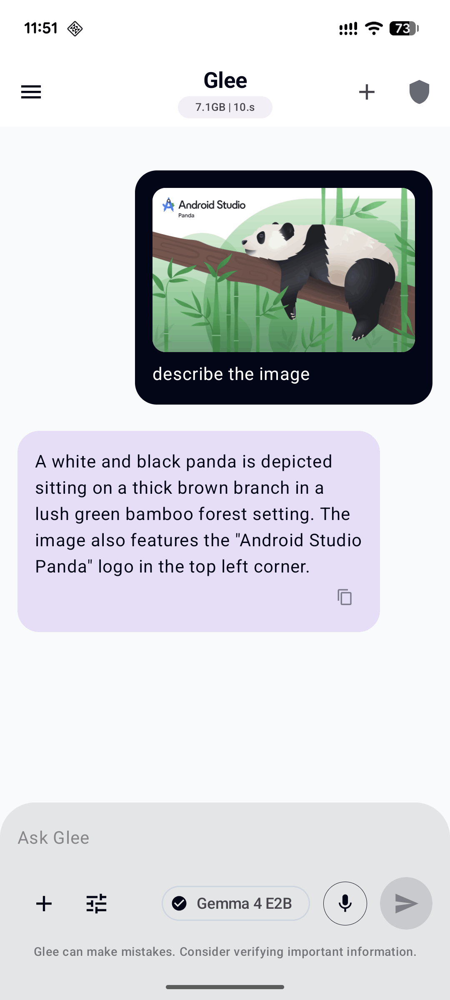
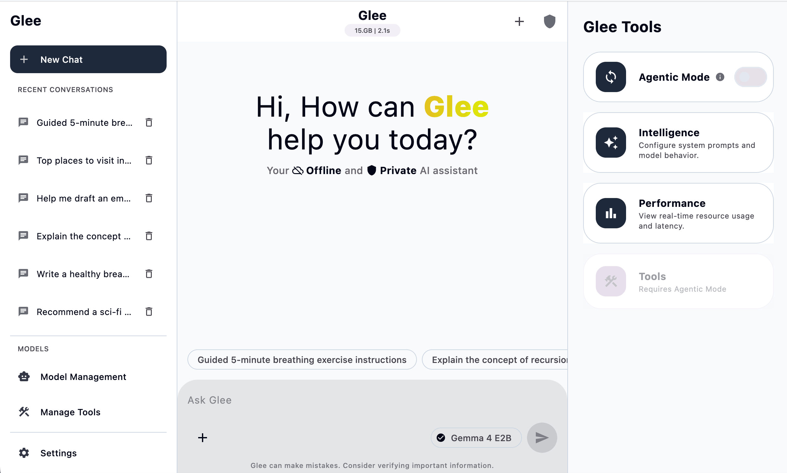
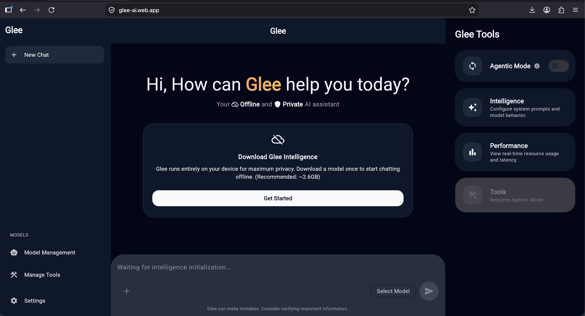

# Glee - Private, Local-First AI Assistant

Glee is a production-grade, open-source AI assistant built with **Kotlin Multiplatform** and **Compose Multiplatform**. It allows you to run state-of-the-art AI models (like Gemma 4, Phi-4) entirely on your device, ensuring maximum privacy and offline accessibility.


## 🚀 Features

- **Local-First Intelligence**: All AI processing happens on-device using LiteRT (TensorFlow Lite).
- **Private by Design**: Your chats and data never leave your device.
- **Cross-Platform**: Run on Android, iOS, Desktop (Windows, macOS, Linux), and Web (WASM).
- **Agentic Mode (Alpha)**: Enable Glee to use tools and reasoning steps to solve complex tasks.
- **Dynamic Themes**: Supports Material 3 Expressive design with adaptive colors (on Android).
- **Voice Support**: Integrated speech-to-text for hands-free interaction.
- **File Attachments**: Support for image analysis with vision-enabled models.

## 🛠 Tech Stack

- **UI Framework**: [Compose Multiplatform](https://github.com/JetBrains/compose-multiplatform)
- **Language**: [Kotlin Multiplatform](https://kotlinlang.org/docs/multiplatform.html)
- **Dependency Injection**: [Koin](https://insert-koin.io/)
- **Networking**: [Ktor](https://ktor.io/)
- **Image Loading**: [Coil 3](https://coil-kt.github.io/coil/)
- **Local Database**: [Room](https://developer.android.com/jetpack/androidx/releases/room)
- **Settings**: [Multiplatform Settings](https://github.com/russhwolf/multiplatform-settings)
- **File Handling**: [FileKit](https://github.com/vinceglb/FileKit)
- **Navigation**: [Navigation 3 (Compose)](https://developer.android.com/jetpack/compose/navigation)
- **AI Engine**: [LiteRT (formerly TensorFlow Lite)](https://ai.google.dev/edge/litert)

## 📱 Supported Platforms

| Platform | Status | Artifact |
| :--- | :--- | :--- |
| **Android** | Production Ready | APK, AAB |
| **iOS** | Development | App Store |
| **Desktop (macOS)** | Production Ready | DMG |
| **Desktop (Windows)** | Production Ready | MSI |
| **Desktop (Linux)** | Production Ready | DEB |
| **Web (WASM)** | Preview (WebGPU) | Firebase Hosting |

---

## 📸 Screenshots

| Android | Desktop | Web |
| :---: | :---: | :---: |
|  |  |  |

---

## 🏗 Build and Run

### Prerequisites
- JDK 17+
- Android Studio (for Android/Common development)
- Xcode (for iOS development)
- Firebase CLI (for web deployment)

### Android
```bash
./gradlew :shared:assembleDebug
# For release with auto-versioning
./gradlew :shared:generateAndroidRelease
```

### Desktop (JVM)
```bash
./gradlew :shared:run
# For packaging installers
./gradlew :shared:packageReleaseDmg # macOS
./gradlew :shared:packageReleaseMsi # Windows
./gradlew :shared:packageReleaseDeb # Linux
```

### Web (WASM)
```bash
./gradlew :shared:wasmJsBrowserDevelopmentRun
# For deployment
./gradlew :shared:deployWeb
```

### iOS
1. Open `iosApp/iosApp.xcodeproj` in Xcode.
2. Select your target and run.

## 🔑 Configuration

To access gated models on Hugging Face, add your `HF_TOKEN` to `glee.properties` in the root directory:
```properties
HF_TOKEN=your_token_here
```

For Android signing, copy `release.properties.example` to `release.properties` and fill in your keystore details.

## 🤝 Contributing

Contributions are welcome! Glee is an open-source project and we appreciate help with bug fixes, new features, and documentation.

## 📄 License

This project is licensed under the Apache 2.0 License. See the [LICENSE](LICENSE) file for details.

---
Built with ❤️ by [ssverma](https://github.com/ssverma)
